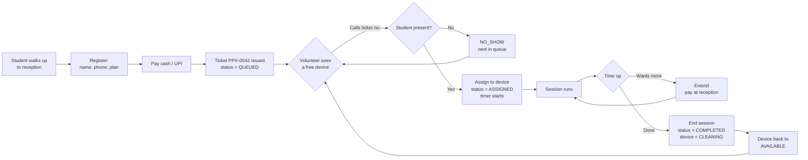
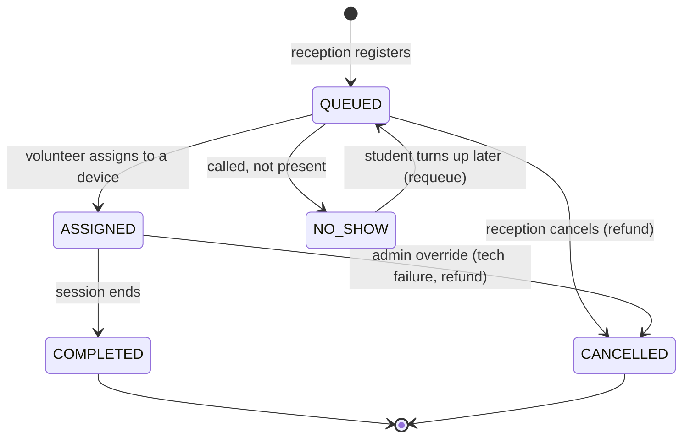
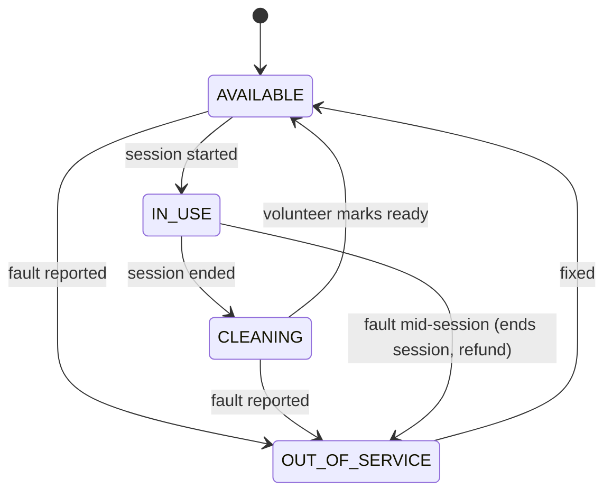
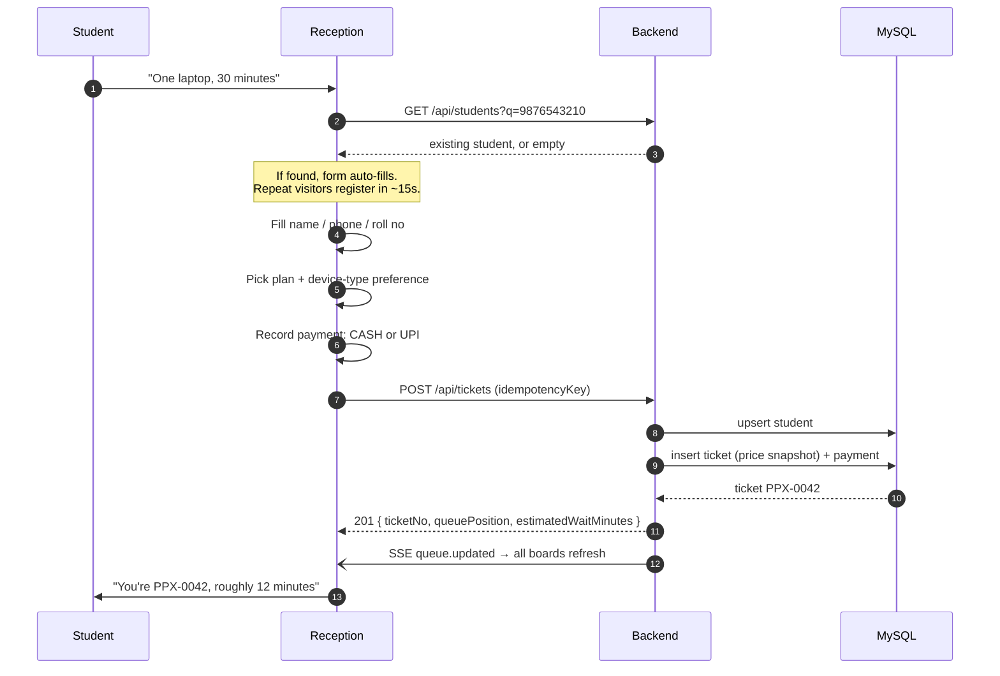
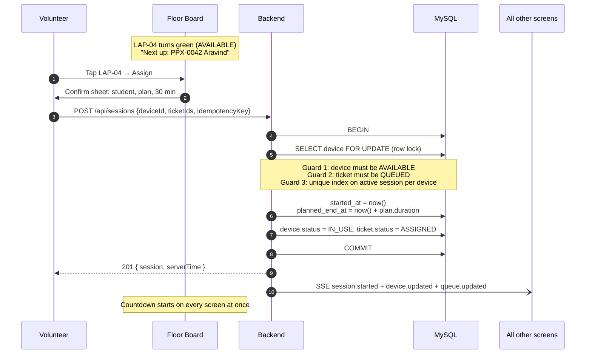
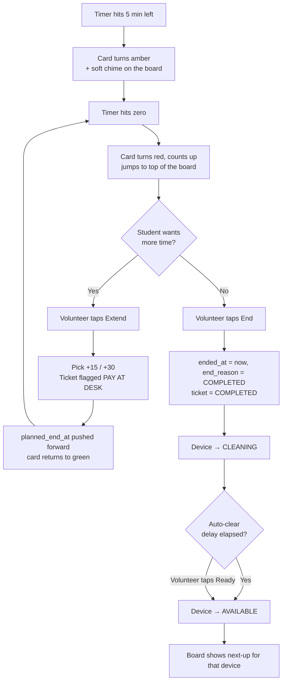
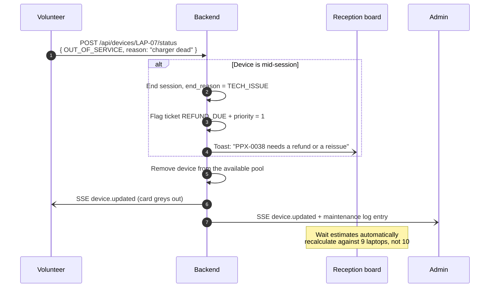

# 02 — Workflows

Every operational flow, end to end. This is the document to hand a volunteer captain
and the document to write tests against.

---

## 1. The lifecycle at a glance



---

## 2. State machines

Writing the legal transitions down is the single highest-value thing in this document.
Anything not drawn here is a bug — the API rejects it with `409 INVALID_TRANSITION`.

### 2.1 Ticket



| Status | Meaning | Who can move it |
|---|---|---|
| `QUEUED` | Paid, waiting for a device | — |
| `ASSIGNED` | Currently playing | Volunteer, Admin |
| `COMPLETED` | Finished normally | Volunteer, Admin |
| `NO_SHOW` | Called but absent. **Requeue-able**, keeps its original `queued_at` on requeue so they don't lose their place | Volunteer, Admin |
| `CANCELLED` | Voided before or during play. Triggers a refund record | Reception (pre-assign), Admin (any time) |

> **Note on `NO_SHOW → QUEUED`:** requeueing restores the original `queued_at`. A
> student who stepped out for two minutes shouldn't drop to the back of a 40-person
> line. Admin can override to `now()` if someone is abusing it.

### 2.2 Device



`CLEANING` is a deliberate speed bump — 60–90 seconds to wipe a controller, reset a
game, adjust a seat. Admin can set the auto-clear delay in settings, or set it to `0`
to skip the state entirely.

**`OUT_OF_SERVICE` requires a reason string.** That reason lands in the admin's
maintenance report and is what tells you afterwards which laptop keeps dying.

### 2.3 Session (derived, not stored)

Session state is **computed from timestamps**, not stored in a column. This matters —
see §4.

| Derived state | Condition | UI treatment |
|---|---|---|
| `RUNNING` | `now < planned_end_at − warningThreshold` | Green, counting down |
| `ENDING_SOON` | within `warningThreshold` (default 5 min) of the end | Amber, pulsing |
| `OVERDUE` | `now > planned_end_at` and `ended_at IS NULL` | Red, counting **up**, floats to the top of the board |
| `ENDED` | `ended_at IS NOT NULL` | Off the board |

---

## 3. Workflow: registration (Reception)

**Actor:** Reception · **Screen:** [Register](05-ui-screens.md#r2--register-student) ·
**Target time:** under 60 seconds



**Rules**

1. **Phone number is the natural key** for a student. Typing an existing phone
   auto-fills the rest — this is what makes repeat registration fast.
2. Payment MUST be recorded in the same transaction as the ticket. A ticket can never
   exist without a matching payment row (or an explicit `WAIVED` flag with a reason).
3. The plan's **name, duration and price are snapshotted onto the ticket**. If admin
   raises the laptop price at 3 pm, the 2 pm tickets keep the 2 pm price. Without this,
   your end-of-day revenue report silently becomes fiction.
   > **Industry term:** this is **denormalisation for historical accuracy**, the same
   > reason an invoice line stores the price rather than pointing at the product.
4. **Device-type preference is optional.** No preference = eligible for any device,
   which means a shorter wait. The UI says so: *"Any device — fastest"*.
5. The response returns `queuePosition` and `estimatedWaitMinutes` so reception can set
   expectations out loud. Estimate =
   `(ticketsAhead ÷ eligibleDevices) × averagePlanDuration`, clamped to a 5-minute
   granularity and labelled *approximately*.
6. **Idempotency:** the client generates a UUID `idempotencyKey` per form submission.
   A double-click, or a retry after a Wi-Fi blip, returns the *same* ticket instead of
   charging the student twice.
   > **Industry term: idempotency key.** Standard practice in any payment-adjacent API.

---

## 4. Workflow: assignment and the timer (Volunteer)

**Actor:** Volunteer · **Screen:** [Floor Board](05-ui-screens.md#v1--floor-board)



### 4.1 Timer design — the important part

**The server does not run a timer per session.** It stores two timestamps:

```
started_at      = 2026-09-14T09:12:03Z
planned_end_at  = 2026-09-14T09:42:03Z
```

Every client computes `remaining = planned_end_at − now()` and re-renders once a
second. That's it.

Why this and not a ticking server-side timer:

- **Refresh-proof.** Reload the page, the countdown is still correct.
- **Restart-proof.** Restart the backend mid-event; nothing is lost, because nothing
  was in memory.
- **Consistent.** Four tablets show the same number because they're deriving it from
  the same two timestamps, not from four independent counters.
- **Cheap.** 13 concurrent sessions cost zero server threads.

> **Industry term: server-authoritative time.** The server owns the truth; clients only
> render it. Any design where the client's own clock decides when time is up is wrong —
> a volunteer with a misconfigured tablet would cut sessions short.

**Clock skew correction.** Every API response includes a `serverTime` field. On login
the client computes `offset = serverTime − Date.now()` and applies that offset to all
countdown maths. A tablet whose clock is four minutes fast still shows the right number.

**The one scheduled job.** A Spring `@Scheduled` task runs every 15 seconds, finds
sessions where `planned_end_at < now() AND ended_at IS NULL`, and emits an SSE
`session.overdue` event once per session (tracked by a `overdue_notified_at` column so
it doesn't spam). It does **not** auto-end sessions — a human always ends a session, so
there's always someone accountable for the device being free.

### 4.2 Concurrency: two volunteers, one device

Two volunteers on two tablets tap Assign on `LAP-04` within the same second. Exactly
one must win. Three layers, in order:

1. **Pessimistic row lock** — `SELECT … FOR UPDATE` on the device row inside the
   transaction. The second request blocks until the first commits, then sees
   `IN_USE` and fails cleanly.
2. **Database constraint as the backstop.** MySQL has no partial indexes, so we use the
   standard workaround: a `STORED` **generated column** that holds `device_id` only
   while the session is active and `NULL` once it has ended — and a unique index
   ignores `NULL`s:
   ```sql
   ALTER TABLE play_session
     ADD COLUMN active_device_id BIGINT
       GENERATED ALWAYS AS (IF(ended_at IS NULL, device_id, NULL)) STORED,
     ADD UNIQUE KEY ux_active_session_per_device (active_device_id);
   ```
   Even if the application logic is wrong, MySQL refuses a second active session on one
   device. **Correctness belongs in the database, not only in the service layer.**
   Full explanation in [03-data-model.md §3.1](03-data-model.md#31-no-partial-indexes--generated-columns).
3. **A clear error, not a stack trace** — the loser gets
   `409 DEVICE_NOT_AVAILABLE`, and the UI shows a toast: *"LAP-04 was just taken by
   Meera. Here's the next free device."* — and refreshes the board.

The same pattern guards a student being in two sessions at once:
```sql
ALTER TABLE play_session_player
  ADD COLUMN active_ticket_id BIGINT
    GENERATED ALWAYS AS (IF(active, ticket_id, NULL)) STORED,
  ADD UNIQUE KEY ux_active_ticket (active_ticket_id);
```

> **Write a test that proves this fires** — ten threads, one device, exactly one `201`.
> A guard you have never seen reject something is a guard you don't have. It's task 1.7
> in [07-build-plan.md](07-build-plan.md#phase-1--walking-skeleton--t17).

---

## 5. Workflow: ending a session



**End reasons** — always captured, because they're the difference between a report and
a guess:

| Reason | When | Refund? |
|---|---|---|
| `COMPLETED` | Ran its course | No |
| `ENDED_EARLY` | Student left early | No (note it) |
| `TECH_ISSUE` | Device failed mid-session | Yes — flags the ticket for refund/reissue |
| `ADMIN_OVERRIDE` | Admin force-ended | Admin decides; reason text required |

**Extensions.** An extension is a **new payment on the same ticket**, not a new ticket.
The volunteer extends immediately (the student keeps playing — never interrupt play to
chase cash) and the ticket is flagged `PAYMENT_DUE`. Reception's screen shows a
**"Dues" tab** listing every flagged ticket so it gets collected before the student
leaves. Admin's end-of-day report lists any dues never cleared.

---

## 6. Workflow: the queue

### 6.1 Ordering

The queue is **per device type**, not one global line. A student waiting for the racing
sim must not block ten laptop players.

For a given free device `D` of type `T`, the eligible queue is:

```sql
SELECT * FROM ticket
WHERE status = 'QUEUED'
  AND (preferred_device_type_id = T OR preferred_device_type_id IS NULL)
ORDER BY priority DESC, queued_at ASC;
```

- `priority` is `0` for everyone by default. Admin can bump it (faculty, a guest, a
  student who got burnt by a `TECH_ISSUE` refund). Every bump is written to the audit
  log — that's what stops it becoming a favour economy.
- Ties break on `queued_at`, so it's FIFO in practice.

### 6.2 Skipping

The board shows **next-up**, but the volunteer can search and pick anyone in the queue.
Skipping the top of the list REQUIRES a one-tap reason (`Not present` / `Waiting for a
specific device` / `Other`) and is audit-logged. Not a bureaucratic hoop — it's what
lets admin answer *"why did PPX-0031 wait 50 minutes?"* on Monday.

### 6.3 Multi-player sessions (PS5)

A device with `capacity > 1` can take multiple tickets in one session. The assign sheet
for `PS5-01` shows *"Seats: 2"* and lets the volunteer pick one or two queued tickets.

- Session `planned_end_at` uses the **shortest** plan among the players, so nobody
  overstays what they paid for.
- Both tickets go `ASSIGNED`; both go `COMPLETED` when the session ends.
- Leaving a seat empty is allowed — do not block a session on finding a second player.

---

## 7. Workflow: device faults



A student cut off by a fault gets `priority = 1` automatically — they go to the front of
the queue for the next free device of that type. Fair, and it removes a judgement call
from a stressed 19-year-old volunteer at 4 pm.

---

## 8. Workflow: shift handover

Volunteers rotate. Handover is a five-line checklist, not a conversation:

1. Outgoing volunteer taps **End shift** on their profile menu.
2. The app shows a **handover summary**: sessions currently running, anything overdue,
   any device out-of-service, any ticket flagged `PAYMENT_DUE`.
3. Outgoing volunteer clears anything they can clear.
4. Incoming volunteer logs in on the same tablet. The board is byte-identical — **all
   state lives on the server**, nothing in a browser tab.
5. Both names sit in the audit log against that timestamp.

This works because no state was ever local. That's the payoff for the timer design in
§4.1.

---

## 9. Workflow: opening and closing the day

### Opening (T−30 minutes)

| ✓ | Step |
|---|---|
| ☐ | Admin logs in, checks **Devices** — every station `AVAILABLE`, faults from yesterday resolved |
| ☐ | Check **Plans** — correct prices are active |
| ☐ | Confirm the **cash float** in the box and enter the opening balance in Settings |
| ☐ | Reception and volunteer devices logged in, board loading, live-update dot green |
| ☐ | Print the paper fallback sheets — [08-event-day-runbook.md](08-event-day-runbook.md#6-paper-fallback) |

### Closing

| ✓ | Step |
|---|---|
| ☐ | End every running session (admin has a bulk **End all** with a confirmation) |
| ☐ | Clear every `PAYMENT_DUE` ticket, or write off with a reason |
| ☐ | Open **Reports → Daily Summary**; reconcile cash box against `CASH` revenue |
| ☐ | Reconcile the UPI app total against `UPI` revenue |
| ☐ | Export the day's CSV; take a database backup (one command, in the runbook) |
| ☐ | Mark any device needing overnight repair as `OUT_OF_SERVICE` with a reason |

---

## 10. Edge cases the build MUST handle

Decide these now, in a doc, rather than at 4 pm on event day with a queue forming.

| # | Situation | Behaviour |
|---|---|---|
| E1 | Student registers, then leaves before being called | Volunteer marks `NO_SHOW`. Reception can refund from the ticket screen |
| E2 | No-show returns 20 minutes later | Reception requeues; original `queued_at` is kept, so they're near the front |
| E3 | Two volunteers assign the same device simultaneously | One wins; the other gets a clear toast and a refreshed board (§4.2) |
| E4 | Backend restarts mid-event | Zero session loss. Clients auto-reconnect via SSE and refetch the board |
| E5 | Volunteer tablet loses Wi-Fi | Board shows an amber **"Reconnecting…"** banner; the last-known state stays on screen but every action button is disabled — better to block an action than to fire a stale one |
| E6 | Admin edits a plan's price mid-event | Only affects tickets sold *after* the edit. Existing tickets keep their snapshot |
| E7 | Device deleted while a session is running | Blocked. Admin must end the session first. Devices are **soft-deleted** (`active = false`) so historical reports still resolve `LAP-07` |
| E8 | Student wants to swap laptop → PS5 while queued | Reception edits the ticket's preference. Fare difference is a new payment row |
| E9 | Session runs 20 minutes overdue because nobody ended it | The card is red at the top of the board the whole time. The daily report lists every overdue session and by how much |
| E10 | Duplicate registration (same phone, twice, same day) | Allowed — a student can genuinely buy two turns. Reception sees an inline hint: *"This student already has an active ticket: PPX-0042"* |
| E11 | Cash box and report disagree at close | The audit log has every payment with the collector's name and a timestamp. Filter by collector to find the gap |
| E12 | Power cut | UPS on the server laptop; DB is on disk with WAL, so nothing is lost. Paper fallback covers the outage; entries are backfilled afterwards |
