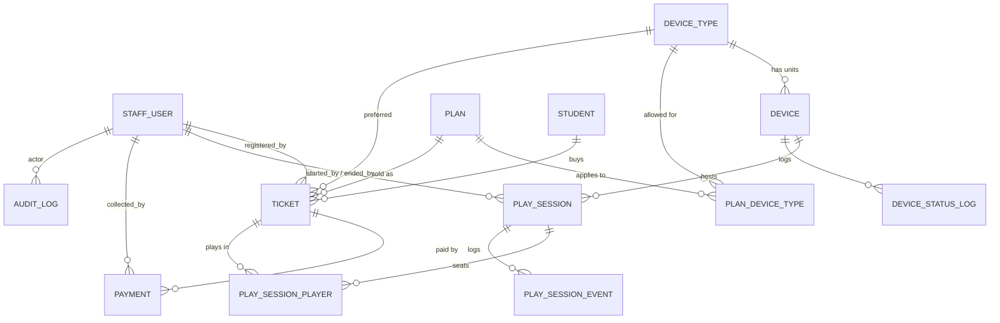

# 03 — Data Model

**MySQL 8.4 LTS**, InnoDB, `utf8mb4`. Migrations managed with **Flyway**
(`V1__initial_schema.sql`, `V2__seed_reference_data.sql`, …). Never edit an applied
migration — always add a new one.

> **Read §3 and §4 before writing any DDL.** MySQL has no partial indexes and no
> sequences, and its timestamp types are a trap. Those three gaps are handled here
> with standard workarounds; if you skip them you will reintroduce the exact bugs
> this design was built to prevent.

---

## 1. Entity relationship diagram



> **Why `play_session` and not `session`:** "session" is badly overloaded in a Spring
> app — HTTP session, Spring Security session, Hibernate `Session`. Naming the table
> and the JPA entity `PlaySession` removes every one of those collisions. The **domain
> word stays "session"** everywhere else: in the API (`/api/sessions`), the SSE events
> (`session.started`), the UI, and these docs.

---

## 2. Tables

Every table: `ENGINE=InnoDB DEFAULT CHARSET=utf8mb4 COLLATE=utf8mb4_0900_ai_ci`.
Set it once as the database default so you don't have to repeat it.

### 2.1 `staff_user` — the three roles

| Column | Type | Notes |
|---|---|---|
| `id` | `BIGINT AUTO_INCREMENT` PK | |
| `username` | `VARCHAR(50)` | `UNIQUE`, lowercase |
| `password_hash` | `VARCHAR(100)` | **BCrypt**, cost 10 |
| `full_name` | `VARCHAR(100)` | shown in the audit log and on the board |
| `role` | `VARCHAR(20)` | `ADMIN` · `RECEPTION` · `VOLUNTEER` |
| `active` | `BOOLEAN NOT NULL DEFAULT TRUE` | **Deactivate, never delete** — foreign keys point here |
| `last_login_at` | `DATETIME(3)` | |
| `created_at` | `DATETIME(3) NOT NULL` | |

> Seed exactly one admin in `V2`. Every other account is created from the UI.
> Force a password change on first login for the seeded admin.

### 2.2 `device_type` — PS5, PC, Racing Sim, Laptop

| Column | Type | Notes |
|---|---|---|
| `id` | `BIGINT AUTO_INCREMENT` PK | |
| `code` | `VARCHAR(20)` | `UNIQUE`, uppercase, e.g. `PS5`. Used as the device code prefix |
| `name` | `VARCHAR(60)` | `PlayStation 5` |
| `icon` | `VARCHAR(40)` | lucide-react icon name, e.g. `gamepad-2` |
| `default_capacity` | `SMALLINT` | seats per unit. PS5 → 2, everything else → 1 |
| `sort_order` | `SMALLINT` | display order on the board |
| `active` | `BOOLEAN NOT NULL DEFAULT TRUE` | soft delete |

**This table is why the system is scalable.** Adding VR headsets on day 2 is one INSERT
from the admin UI — no enum, no deploy, no schema change.

### 2.3 `device` — one physical station

| Column | Type | Notes |
|---|---|---|
| `id` | `BIGINT AUTO_INCREMENT` PK | |
| `device_type_id` | `BIGINT` FK | |
| `code` | `VARCHAR(20)` | `UNIQUE`, e.g. `LAP-04`. Printed on a sticker on the machine |
| `label` | `VARCHAR(60)` | optional friendly name, e.g. `Corner laptop` |
| `location_note` | `VARCHAR(120)` | `Back row, near the window` — helps a new volunteer find it |
| `capacity` | `SMALLINT` | defaults from the device type, overridable per unit |
| `status` | `VARCHAR(20)` | `AVAILABLE` · `IN_USE` · `CLEANING` · `OUT_OF_SERVICE` |
| `status_reason` | `VARCHAR(200)` | REQUIRED when `OUT_OF_SERVICE` |
| `status_changed_at` | `DATETIME(3)` | drives the auto-clear of `CLEANING` |
| `active` | `BOOLEAN NOT NULL DEFAULT TRUE` | soft delete |
| `version` | `BIGINT NOT NULL DEFAULT 0` | JPA `@Version` — **optimistic locking** |
| `created_at` | `DATETIME(3) NOT NULL` | |

```sql
CREATE INDEX ix_device_status ON device (active, status);
```

> MySQL has no partial indexes, so this is a plain composite index with `active` as the
> leading column rather than Postgres's `WHERE active`. Same effect for our queries.

### 2.4 `plan` — pricing

| Column | Type | Notes |
|---|---|---|
| `id` | `BIGINT AUTO_INCREMENT` PK | |
| `name` | `VARCHAR(60)` | `Quick Play`, `Standard`, `Marathon` |
| `duration_minutes` | `SMALLINT` | > 0 |
| `price_paise` | `INT` | **integer paise.** `5000` = ₹50.00 |
| `description` | `VARCHAR(200)` | shown in the reception dropdown |
| `sort_order` | `SMALLINT` | |
| `active` | `BOOLEAN NOT NULL DEFAULT TRUE` | archived plans stay for historical tickets |
| `created_at` | `DATETIME(3) NOT NULL` | |

> **Money rule:** never `FLOAT` or `DOUBLE` for currency — `0.1 + 0.2 != 0.3` in binary
> floating point, and it will cost you a rupee in the close-out reconciliation. Store
> integer minor units (paise); format at the edge. `DECIMAL(10,2)` is also correct;
> `FLOAT`/`DOUBLE` never is.

> **Price editing:** editing a plan's price is allowed and only affects future sales,
> because every ticket carries a **price snapshot** (§2.7). Editing `duration_minutes`
> mid-event is allowed for the same reason. Deleting a plan is a soft delete.

### 2.5 `plan_device_type` — which plans apply to which device types

| Column | Type |
|---|---|
| `plan_id` | `BIGINT` FK, PK part |
| `device_type_id` | `BIGINT` FK, PK part |

Lets the racing sim cost more than a laptop without duplicating the whole plan concept.
A plan with **no rows here means "applies to all device types"** — the common case, so
the admin UI defaults to that.

### 2.6 `student`

| Column | Type | Notes |
|---|---|---|
| `id` | `BIGINT AUTO_INCREMENT` PK | |
| `full_name` | `VARCHAR(100)` | |
| `phone` | `VARCHAR(15)` | **`UNIQUE`** — the natural key for auto-fill on repeat visits |
| `roll_no` | `VARCHAR(30)` | optional, indexed |
| `department` | `VARCHAR(60)` | optional — feeds a "which department played most" report |
| `year_of_study` | `SMALLINT` | optional |
| `created_at` | `DATETIME(3) NOT NULL` | |

Volunteer-facing DTOs expose `firstName` only — never `phone`. See
[01-product-spec.md](01-product-spec.md#8-privacy-and-data-handling).

### 2.7 `ticket` — one purchase, one turn

The centre of the model.

| Column | Type | Notes |
|---|---|---|
| `id` | `BIGINT AUTO_INCREMENT` PK | |
| `ticket_no` | `VARCHAR(12)` | `UNIQUE`, `PPX-0042`. From the counter table in §3.2 |
| `student_id` | `BIGINT` FK | |
| `plan_id` | `BIGINT` FK | for joins/reporting |
| `plan_name_snapshot` | `VARCHAR(60)` | ⎫ |
| `duration_minutes_snapshot` | `SMALLINT` | ⎬ **frozen at sale time** |
| `price_paise_snapshot` | `INT` | ⎭ |
| `preferred_device_type_id` | `BIGINT` FK, nullable | `NULL` = any device |
| `status` | `VARCHAR(20)` | `QUEUED` · `ASSIGNED` · `COMPLETED` · `NO_SHOW` · `CANCELLED` |
| `payment_status` | `VARCHAR(20)` | `PAID` · `PAYMENT_DUE` · `WAIVED` · `REFUNDED` |
| `priority` | `SMALLINT NOT NULL DEFAULT 0` | Higher jumps the queue |
| `queued_at` | `DATETIME(3)` | queue ordering key. Preserved across a `NO_SHOW → QUEUED` requeue |
| `assigned_at` | `DATETIME(3)` | ⎫ |
| `completed_at` | `DATETIME(3)` | ⎬ nullable, set on transition |
| `cancelled_at` | `DATETIME(3)` | ⎭ |
| `no_show_count` | `SMALLINT NOT NULL DEFAULT 0` | 3+ is a signal, not a rule |
| `registered_by_user_id` | `BIGINT` FK | |
| `notes` | `VARCHAR(300)` | |
| `created_at` | `DATETIME(3) NOT NULL` | |

```sql
-- the query the queue runs, several times a second across all boards
CREATE INDEX ix_ticket_queue ON ticket (status, priority DESC, queued_at);
CREATE INDEX ix_ticket_created ON ticket (created_at);
```

> MySQL 8.0+ supports descending indexes, so `priority DESC` is a real descending index
> rather than being silently ignored as it was in 5.7.

### 2.8 `payment` — the ledger

| Column | Type | Notes |
|---|---|---|
| `id` | `BIGINT AUTO_INCREMENT` PK | |
| `ticket_id` | `BIGINT` FK | |
| `amount_paise` | `INT` | negative for a refund |
| `kind` | `VARCHAR(20)` | `INITIAL` · `EXTENSION` · `REFUND` |
| `method` | `VARCHAR(20)` | `CASH` · `UPI` · `WAIVED` |
| `reference_no` | `VARCHAR(60)` | UPI transaction ref, if any |
| `collected_by_user_id` | `BIGINT` FK | **who touched the money** |
| `collected_at` | `DATETIME(3) NOT NULL` | |
| `note` | `VARCHAR(200)` | required for `WAIVED` and `REFUND` |

```sql
CREATE INDEX ix_payment_collected ON payment (collected_at, method);
```

**Append-only.** Never update or delete a payment row — a refund is a *new row with a
negative amount*. A ticket's balance is `SUM(amount_paise)`.
> **Industry term: an append-only ledger.** It's how accounting systems work, and it's
> the only structure that survives an argument about what happened at 3:15 pm.

### 2.9 `play_session` — an actual play period

| Column | Type | Notes |
|---|---|---|
| `id` | `BIGINT AUTO_INCREMENT` PK | |
| `device_id` | `BIGINT` FK | |
| `started_at` | `DATETIME(3) NOT NULL` | ⎫ **the whole timer, right here** |
| `planned_end_at` | `DATETIME(3) NOT NULL` | ⎭ moves forward on an extension |
| `ended_at` | `DATETIME(3)` | `NULL` = still running |
| `active_device_id` | `BIGINT` **GENERATED** | see §3.1 — this is the concurrency guard |
| `end_reason` | `VARCHAR(20)` | `COMPLETED` · `ENDED_EARLY` · `TECH_ISSUE` · `ADMIN_OVERRIDE` |
| `end_note` | `VARCHAR(200)` | required for `TECH_ISSUE` and `ADMIN_OVERRIDE` |
| `extension_minutes_total` | `SMALLINT NOT NULL DEFAULT 0` | |
| `overdue_notified_at` | `DATETIME(3)` | so the scheduled job alerts once, not every 15s |
| `started_by_user_id` | `BIGINT` FK | |
| `ended_by_user_id` | `BIGINT` FK, nullable | |

```sql
CREATE INDEX ix_session_active ON play_session (ended_at, planned_end_at);
CREATE INDEX ix_session_started ON play_session (started_at);
```

There is **no `status` column**. Running / ending-soon / overdue are computed from
`planned_end_at` and `ended_at` — a column would only be a second source of truth to
drift out of sync.

### 2.10 `play_session_player` — supports the 2-seat PS5

| Column | Type | Notes |
|---|---|---|
| `play_session_id` | `BIGINT` FK, PK part | |
| `ticket_id` | `BIGINT` FK, PK part | |
| `seat_no` | `SMALLINT` | 1..capacity |
| `active` | `BOOLEAN NOT NULL DEFAULT TRUE` | mirrors `play_session.ended_at IS NULL` |
| `active_ticket_id` | `BIGINT` **GENERATED** | see §3.1 |

A single-player session has exactly one row here. Modelling it as a join table from the
start costs almost nothing and means the PS5 case is not a special case in the code.

### 2.11 `play_session_event` — the session's own history

| Column | Type | Notes |
|---|---|---|
| `id` | `BIGINT AUTO_INCREMENT` PK | |
| `play_session_id` | `BIGINT` FK | |
| `type` | `VARCHAR(20)` | `STARTED` · `EXTENDED` · `WARNED` · `OVERDUE` · `ENDED` |
| `payload` | `JSON` | e.g. `{"minutes": 15}` |
| `occurred_at` | `DATETIME(3) NOT NULL` | |
| `by_user_id` | `BIGINT` FK, nullable | `NULL` for system-generated events |

### 2.12 `device_status_log` — the maintenance record

| Column | Type |
|---|---|
| `id` | `BIGINT AUTO_INCREMENT` PK |
| `device_id` | `BIGINT` FK |
| `from_status` / `to_status` | `VARCHAR(20)` |
| `reason` | `VARCHAR(200)` |
| `changed_at` | `DATETIME(3) NOT NULL` |
| `by_user_id` | `BIGINT` FK |

Answers, on Monday: *which laptop kept dying, and for how long was it down?*

### 2.13 `audit_log` — who did what

| Column | Type | Notes |
|---|---|---|
| `id` | `BIGINT AUTO_INCREMENT` PK | |
| `actor_user_id` | `BIGINT` FK | |
| `action` | `VARCHAR(60)` | `TICKET_CANCELLED`, `PLAN_PRICE_CHANGED`, `PRIORITY_BUMPED`, `QUEUE_SKIPPED`, `SESSION_FORCE_ENDED`, `EXPORT_DOWNLOADED` |
| `entity_type` / `entity_id` | `VARCHAR(40)` / `BIGINT` | |
| `before_json` / `after_json` | `JSON` | nullable |
| `occurred_at` | `DATETIME(3) NOT NULL` | |
| `ip_address` | `VARCHAR(45)` | |

```sql
CREATE INDEX ix_audit ON audit_log (occurred_at, action);
```

Write to this from a **Spring AOP aspect** or a service-layer helper, not scattered
through controllers. Log every money-touching, override, and configuration action.

> MySQL's `JSON` type stores and validates JSON but has **no GIN-style indexing**, so
> don't plan to query *inside* `before_json`. You'll filter on `action` and
> `occurred_at`, which is exactly what the index above covers.

### 2.14 `event_settings` — single row, `id = 1`

| Column | Type | Default |
|---|---|---|
| `event_name` | `VARCHAR(100)` | `PlayPlex` |
| `warning_threshold_minutes` | `SMALLINT` | `5` |
| `cleaning_auto_clear_seconds` | `SMALLINT` | `90` (`0` disables the `CLEANING` state) |
| `allow_extensions` | `BOOLEAN` | `TRUE` |
| `max_extension_minutes` | `SMALLINT` | `30` |
| `opening_cash_float_paise` | `INT` | `0` |
| `timezone` | `VARCHAR(40)` | `Asia/Kolkata` |

Every operational knob lives here, so tuning the event does not require a redeploy.

---

## 3. The three MySQL gaps, and how they're closed

This is the section that differs most from a PostgreSQL design. Read it carefully.

### 3.1 No partial indexes → generated columns

The correctness rule is: **one active session per device, ever**. In PostgreSQL that's a
partial unique index. MySQL has no `WHERE` clause on an index.

The workaround leans on a rule MySQL shares with the SQL standard: **a unique index
ignores `NULL`s**, so any number of rows may hold `NULL` in a unique column. So we add a
column that holds the `device_id` *only while the session is active*, and `NULL` once it
has ended:

```sql
ALTER TABLE play_session
  ADD COLUMN active_device_id BIGINT
    GENERATED ALWAYS AS (IF(ended_at IS NULL, device_id, NULL)) STORED,
  ADD UNIQUE KEY ux_active_session_per_device (active_device_id);
```

- While a session runs, `active_device_id = device_id` → the unique key blocks any
  second active session on that device.
- Once `ended_at` is set, the column flips to `NULL` → the device is free again, and any
  number of *ended* sessions can coexist for it.
- It's a **`STORED`** generated column, because MySQL can only build a unique index on a
  stored one. You never write to it; MySQL maintains it.

The same trick guards a ticket being in two sessions at once:

```sql
ALTER TABLE play_session_player
  ADD COLUMN active_ticket_id BIGINT
    GENERATED ALWAYS AS (IF(active, ticket_id, NULL)) STORED,
  ADD UNIQUE KEY ux_active_ticket (active_ticket_id);
```

**In JPA**, map these as read-only so Hibernate never tries to write them:

```java
@Column(name = "active_device_id", insertable = false, updatable = false)
private Long activeDeviceId;
```

> **Industry term: emulating a partial (filtered) unique index.** The same pattern is
> the standard MySQL answer for "unique among non-soft-deleted rows". Worth knowing —
> it comes up in almost every MySQL schema that has soft deletes.

**Write an integration test that proves the index fires** (Phase 1, task 1.7). A guard
you haven't seen reject something is a guard you don't have.

### 3.2 No sequences → a counter table

MySQL has no `CREATE SEQUENCE`, and a generated column **cannot reference an
`AUTO_INCREMENT` column**, so `PPX-` + the row's own id can't be computed in the schema.

Use the canonical MySQL sequence idiom — a one-row counter updated atomically:

```sql
CREATE TABLE seq_counter (
  name      VARCHAR(32)  NOT NULL PRIMARY KEY,
  next_val  BIGINT       NOT NULL
) ENGINE=InnoDB;

INSERT INTO seq_counter (name, next_val) VALUES ('ticket_no', 1);
```

To take the next number, inside the registration transaction:

```sql
UPDATE seq_counter SET next_val = LAST_INSERT_ID(next_val + 1) WHERE name = 'ticket_no';
SELECT LAST_INSERT_ID();   -- returns the value this connection just claimed
```

That two-statement idiom is **atomic and concurrency-safe**: the `UPDATE` takes a row
lock, and `LAST_INSERT_ID()` is per-connection, so two simultaneous registrations can
never receive the same number. Format the result as `PPX-` + `LPAD(n, 4, '0')` in Java.

**Or let Hibernate do it:** `@TableGenerator` implements exactly this pattern natively.

```java
@TableGenerator(name = "ticketNo", table = "seq_counter",
                pkColumnName = "name", valueColumnName = "next_val",
                pkColumnValue = "ticket_no", allocationSize = 1)
```

Keep `allocationSize = 1` so numbers are gapless — students read these aloud, and a jump
from `PPX-0042` to `PPX-0092` looks broken even though it isn't.

**Honest cost:** every registration serialises on one row lock. At roughly one
registration every 90 seconds, this is irrelevant. At thousands per second it would be
the bottleneck — that's the trade you're making, and it's the right one here.

### 3.3 No `timestamptz` → DATETIME plus discipline

MySQL gives you two imperfect choices:

| Type | Behaviour | Verdict |
|---|---|---|
| `TIMESTAMP` | Genuinely UTC internally, but **limited to 2038**, and the first `TIMESTAMP` column in a table can pick up implicit `DEFAULT CURRENT_TIMESTAMP ON UPDATE CURRENT_TIMESTAMP` — a famous source of columns that silently rewrite themselves | ❌ Avoid |
| `DATETIME(3)` | No timezone awareness at all — stores exactly the value you give it, to millisecond precision | ✅ **Use this**, and impose UTC yourself |

**The three settings that make `DATETIME(3)` safe.** All three, or none of them work:

1. **JDBC URL** — the connection stays in UTC, so no silent conversion happens:
   ```
   jdbc:mysql://db:3306/playplex?connectionTimeZone=UTC&forceConnectionTimeZoneToSession=true&characterEncoding=utf8mb4
   ```
2. **JVM** — `-Duser.timezone=UTC` in `JAVA_TOOL_OPTIONS`.
3. **Server** — `--default-time-zone=+00:00` on the MySQL container.

Then map entity fields as `java.time.Instant` and let Hibernate 7 handle it:

```java
@Column(name = "planned_end_at", columnDefinition = "DATETIME(3)")
private Instant plannedEndAt;
```

**Generate session times in the database** with `UTC_TIMESTAMP(3)`, not in Java — one
clock is the authority, and app servers drift. API responses carry `serverTime` so
clients can correct for their own skew; see
[02-workflows.md §4.1](02-workflows.md#41-timer-design--the-important-part).

> **Verify this on day one of Phase 0.** Insert a row, then read it back through both
> JDBC and the `mysql` CLI. If the two disagree by 5½ hours, one of the three settings
> above is missing. Finding that out in Phase 0 costs ten minutes; finding it out on
> event day costs the event.

---

## 4. Enums, constraints and isolation

### Enum handling

Store as `VARCHAR` with a `CHECK` constraint, map with `@Enumerated(EnumType.STRING)`.

- **Not `EnumType.ORDINAL`** — inserting a new enum value in the middle silently
  reinterprets every existing row. A classic production data-corruption bug.
- **Not MySQL's native `ENUM` type** — adding a value needs an `ALTER TABLE`, and its
  ordering and comparison rules surprise people.
- `VARCHAR` + `CHECK` is readable in raw SQL, greppable, and easy to extend.

```sql
ALTER TABLE ticket ADD CONSTRAINT ck_ticket_status
  CHECK (status IN ('QUEUED','ASSIGNED','COMPLETED','NO_SHOW','CANCELLED'));
```

> **`CHECK` constraints are only enforced from MySQL 8.0.16 onward.** Before that MySQL
> parsed and silently ignored them. Another reason the stack pins **8.4 LTS**.

### Isolation level

Set the server to **`READ-COMMITTED`**:

```
--transaction-isolation=READ-COMMITTED
```

MySQL's default is `REPEATABLE READ`, which takes **gap locks** on range scans and is a
common source of surprise deadlocks under concurrent inserts. `READ-COMMITTED` locks
only the rows actually touched, matches PostgreSQL's default, and is what most
high-concurrency MySQL applications run. Our correctness doesn't depend on
`REPEATABLE READ` — it depends on the unique indexes in §3.1 and the explicit
`SELECT … FOR UPDATE` in the assign transaction.

### DDL is not transactional

MySQL commits implicitly around DDL. A migration that fails halfway leaves the schema
**half-changed**, and Flyway cannot roll it back. Practical rules:

- Keep each migration small and focused.
- Always test a migration against a restored copy of the real database first.
- If one fails mid-way, fix forward with a new migration; don't try to "undo".

---

## 5. Seed data (`V2__seed_reference_data.sql`)

### Device types

| code | name | icon | default_capacity | sort_order |
|---|---|---|---|---|
| `PS5` | PlayStation 5 | `gamepad-2` | 2 | 1 |
| `PC` | Gaming PC | `monitor` | 1 | 2 |
| `SIM` | Racing Simulator | `steering-wheel` | 1 | 3 |
| `LAP` | Laptop | `laptop` | 1 | 4 |

### Devices (13 stations)

| code | type | label |
|---|---|---|
| `PS5-01` | PS5 | Console corner |
| `PC-01` | PC | Main rig |
| `SIM-01` | SIM | Racing rig |
| `LAP-01` … `LAP-10` | LAP | Laptop bay 1–10 |

### Plans — **placeholders, confirm before the event**

| name | duration | price | applies to |
|---|---|---|---|
| Quick Play | 15 min | ₹30 | all |
| Standard | 30 min | ₹50 | all |
| Marathon | 60 min | ₹90 | all |
| Sim Sprint | 15 min | ₹50 | Racing Sim only |
| Console Duo | 30 min | ₹80 | PS5 only (2 seats) |

### Other

One `ADMIN` (`admin` / a temporary password, forced change on first login), the
`seq_counter` row for `ticket_no`, and the single `event_settings` row.

---

## 6. Reporting queries (MySQL 8 dialect)

MySQL 8 has CTEs and window functions, so everything the reports need is expressible —
just more verbosely than in PostgreSQL. Note the **range predicates on dates**: never
write `WHERE DATE(col) = ?`, because wrapping a column in a function makes the query
unable to use its index.

```sql
-- Revenue by method (the cash-box reconciliation query)
SELECT p.method,
       SUM(p.amount_paise) / 100.0 AS rupees,
       COUNT(*)                    AS txns
FROM payment p
WHERE p.collected_at >= :dayStart AND p.collected_at < :dayEnd
GROUP BY p.method;
```

```sql
-- Device utilization % (no EXTRACT(EPOCH …) in MySQL — use TIMESTAMPDIFF)
SELECT d.code,
       ROUND(100.0 * COALESCE(SUM(
           TIMESTAMPDIFF(SECOND, s.started_at, COALESCE(s.ended_at, UTC_TIMESTAMP(3)))
       ), 0) / TIMESTAMPDIFF(SECOND, :openTime, :closeTime), 1) AS utilization_pct
FROM device d
LEFT JOIN play_session s
       ON s.device_id = d.id AND s.started_at >= :openTime
WHERE d.active
GROUP BY d.code
ORDER BY utilization_pct DESC;
```

```sql
-- Median wait time. MySQL has no PERCENTILE_CONT, so use a window-function CTE.
WITH waits AS (
  SELECT TIMESTAMPDIFF(SECOND, queued_at, assigned_at) / 60.0        AS wait_minutes,
         ROW_NUMBER() OVER (ORDER BY TIMESTAMPDIFF(SECOND, queued_at, assigned_at)) AS rn,
         COUNT(*)   OVER ()                                          AS n
  FROM ticket
  WHERE assigned_at IS NOT NULL
    AND queued_at >= :dayStart AND queued_at < :dayEnd
)
SELECT AVG(wait_minutes) AS median_wait_minutes
FROM waits
WHERE rn IN (FLOOR((n + 1) / 2), CEILING((n + 1) / 2));
```

```sql
-- Overdue sessions and by how much
SELECT s.id, d.code, st.full_name,
       TIMESTAMPDIFF(SECOND, s.planned_end_at, s.ended_at) / 60.0 AS overdue_minutes
FROM play_session s
JOIN device               d  ON d.id  = s.device_id
JOIN play_session_player  sp ON sp.play_session_id = s.id
JOIN ticket               t  ON t.id  = sp.ticket_id
JOIN student              st ON st.id = t.student_id
WHERE s.ended_at > s.planned_end_at + INTERVAL 5 MINUTE
ORDER BY overdue_minutes DESC;
```

```sql
-- Peak hours (no date_trunc in MySQL — use DATE_FORMAT)
SELECT DATE_FORMAT(started_at, '%Y-%m-%d %H:00:00') AS hour_bucket,
       COUNT(*)                                     AS sessions
FROM play_session
GROUP BY hour_bucket
ORDER BY hour_bucket;
```

```sql
-- Conditional counts. PostgreSQL's FILTER (WHERE …) doesn't exist in MySQL;
-- SUM(condition) works because MySQL evaluates a boolean to 1 or 0.
SELECT SUM(status = 'COMPLETED') AS completed,
       SUM(status = 'NO_SHOW')   AS no_shows,
       SUM(status = 'CANCELLED') AS cancelled,
       COUNT(*)                  AS total
FROM ticket
WHERE created_at >= :dayStart AND created_at < :dayEnd;
```

---

## 7. Backup and retention

- **During the event:** `mysqldump` every 30 minutes to a local folder, via a
  cron / Task Scheduler one-liner. Keep the last 48. It costs nothing and it is the
  difference between a bad hour and a ruined event. Command in
  [08-event-day-runbook.md §7](08-event-day-runbook.md#7-backup--restore).
- Always dump with `--single-transaction` so the backup is consistent and doesn't lock
  the tables while reception is registering someone.
- **After each day:** copy the dump to a second machine or a cloud drive. One copy is
  not a backup.
- **After the event:** run the anonymisation script — clears `student.phone` and
  `student.roll_no`, keeps every session and payment row for the report.
