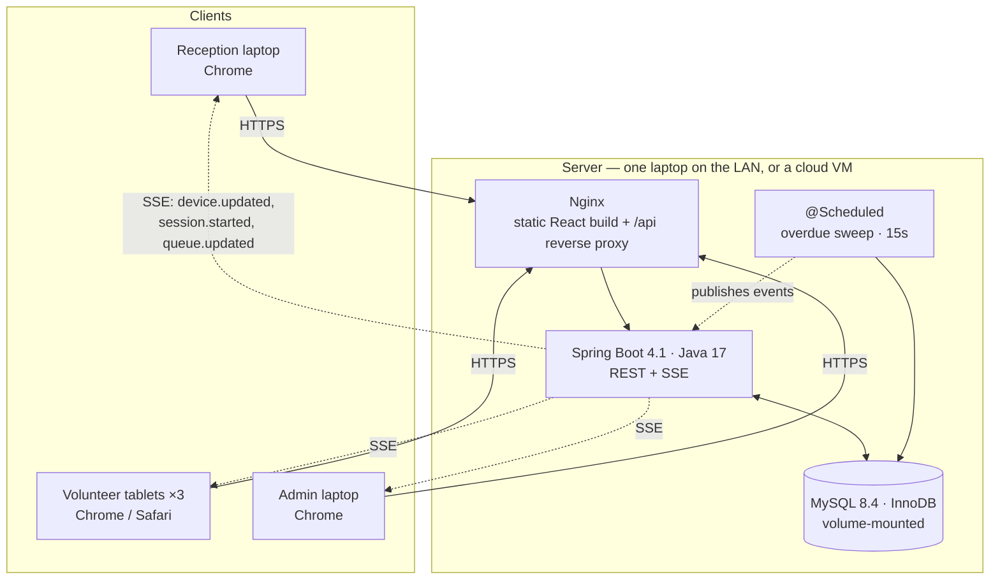

# 06 — Architecture

---

## 1. The stack

| Layer | Choice | Version |
|---|---|---|
| Language | **Java 17 (LTS)** | 17 |
| Backend | Spring Boot | 4.1.x (Spring Framework 7) |
| Persistence | Spring Data JPA + Hibernate | bundled (Jakarta Persistence 3.2) |
| Database | **MySQL 8.4 LTS**, InnoDB, `utf8mb4` | 8.4 |
| JDBC driver | `com.mysql:mysql-connector-j` | 9.x |
| Migrations | Flyway | bundled |
| Security | Spring Security 7 + JWT (jjwt) | bundled |
| JSON | Jackson **3.x** | bundled |
| API docs | springdoc-openapi | 3.0.x (the Spring Boot 4 line) |
| Live updates | `SseEmitter` (Spring MVC) | bundled |
| Frontend | React + Vite + TypeScript | React 19, Vite 7 |
| Styling | Tailwind CSS + shadcn/ui | Tailwind 4 |
| Server state | TanStack Query | v5 |
| Charts | Recharts | v3 |
| Packaging | Docker + Docker Compose | — |
| Testing | JUnit Jupiter **6**, Testcontainers, Vitest, Playwright | — |

> **Version pinning matters here.** Spring Boot 3.x went fully end-of-life on
> 30 June 2026, and MySQL 8.0's extended support ended 30 April 2026. Both are still
> everywhere in tutorials. **Pin Spring Boot 4.1 and MySQL 8.4** and be sceptical of any
> guide written before mid-2026 — see the version traps in §5.

### Why this stack

**Java 17 + Spring Boot 4.** Spring Boot 4's baseline is Java 17, so nothing in the
framework is out of reach — you get every feature, just without Java 21's virtual
threads (which this app has no use for; see §6.1). The hard parts here are all
transactional — don't double-assign a device, don't double-charge a student, don't lose
a payment — which is exactly what a relational database plus Spring's declarative
`@Transactional` is built for. It also builds directly on the Spring Boot you're already
learning, so the learning curve is on the domain, not the framework.

**MySQL 8.4.** Chosen for familiarity and operational simplicity rather than SQL
features. Every college lab, every cheap VPS and every teammate already knows it, and
`mysqldump` + MySQL Workbench is a genuinely easier disaster-recovery story at 4 pm on
event day than anything you'd have to learn under pressure. It costs three specific
features this design relied on. All three have clean workarounds, all three are
implemented in [03-data-model.md §3](03-data-model.md#3-the-three-mysql-gaps-and-how-theyre-closed),
and the trade is examined honestly in ADR-007 and §6.2.

**React + Vite + Tailwind + shadcn/ui.** The requirement is *live data and a good UI*.
shadcn/ui gives production-quality, accessible components whose source you own (they're
copied into your repo, not imported from a package), so a good-looking dashboard is days
of work rather than weeks. Vite's dev server is instant, which matters when you're
iterating on a board layout.

**SSE, not WebSockets.** See ADR-001.

### What was rejected, and why

| Alternative | Why not |
|---|---|
| **PostgreSQL** | Technically the better fit — partial indexes, sequences and `timestamptz` map one-to-one onto this design. Rejected on **familiarity and ops**, deliberately. See ADR-007 |
| Java 21 / 25 | Virtual threads and record patterns are genuinely nicer, but Java 17 was the requirement and this app never touches the ceiling they raise |
| Spring Boot 3.5 | End-of-life since June 2026. No further security patches |
| Next.js full-stack | Faster to ship solo, but drops the Java/Spring Boot practice, which is a stated goal |
| Spring Boot + Thymeleaf | Simplest build, but server-rendered pages fight you on live countdowns and a reactive board — exactly this app's core requirement |
| MongoDB | The data is deeply relational and the guarantees needed are transactional. Wrong tool |
| WebSocket + STOMP | Bidirectional, heavier to set up and debug. We only need server→client |
| Microservices | For a 13-station room. No |
| Redis / a message queue | Nothing here justifies another moving part to fail at 4 pm |

---

## 2. System diagram



Three containers, one network, one volume. That's the entire production topology, and
it is identical on a laptop and in the cloud.

---

## 3. Backend layering

```
com.playplex
├─ config/          SecurityConfig, CorsConfig, SseConfig, SchedulingConfig
├─ domain/          @Entity classes — persistence only, zero business logic
├─ repository/      Spring Data interfaces + @Query for the reporting SQL
├─ service/         ★ ALL business rules live here, transaction boundaries live here
│   ├─ TicketService, PlaySessionService, QueueService
│   ├─ DeviceService, PlanService, ReportService
│   └─ AuditService, SseBroadcastService
├─ web/
│   ├─ controller/  thin — validate, delegate, map. No logic
│   ├─ dto/         request + response records, role-aware
│   └─ mapper/      MapStruct entity↔DTO
└─ common/          exceptions, ProblemDetail handler, Idempotency, time utilities
```

**Four rules that keep this maintainable:**

1. **Never expose a JPA entity from a controller.** Always a DTO. Otherwise you leak
   `passwordHash`, trigger lazy-loading exceptions during serialisation, and can't
   change the schema without breaking the API.
   > **Industry term: the DTO pattern / anti-corruption layer.**
2. **`@Transactional` on service methods, never on controllers or repositories.** The
   service method *is* the unit of work.
3. **Controllers are thin.** If there's an `if` in a controller about business rules,
   it's in the wrong place.
4. **Role-aware DTOs.** `QueueItemDto` serialises `phone` only when the caller is
   RECEPTION or ADMIN. Enforce it in the mapper, not in the frontend.

---

## 4. Architecture decisions

Short **ADRs** (*architecture decision records*) — context, decision, consequences.
Writing these down is what stops the team re-litigating a settled question in week three.

### ADR-001 — SSE over WebSockets for live updates

**Context.** Reception, volunteer and admin boards must reflect the room's state within
a second or two of any change, without polling hammering the DB.

**Decision.** Server-Sent Events over a single `GET /api/stream` endpoint, using Spring
MVC's `SseEmitter` (still current in Spring Framework 7).

**Why.**
- Data flows **one way**: server → client. Commands go over ordinary REST POSTs. That's
  the exact shape SSE is designed for.
- It's plain HTTP. It works through any proxy, is trivially debuggable with `curl`, and
  needs no protocol layer like STOMP.
- The browser's `EventSource` **reconnects automatically** with backoff. With
  WebSockets you write and test that yourself.
- `SseEmitter` is ~40 lines of setup versus a WebSocket + STOMP config.

**Consequences.**
- ✅ Much less code, much less to break under pressure.
- ⚠️ HTTP/1.1 caps a browser at ~6 connections per origin. With under 10 clients, one
  stream each, this is a non-issue. (HTTP/2 removes the cap entirely.)
- ⚠️ Long-lived connections need proxy tuning — `proxy_read_timeout 3600s;` and
  `proxy_buffering off;` in Nginx, plus a `:heartbeat` comment every 20 seconds.
- ⚠️ On Java 17 each open SSE stream is an **async servlet request**, so it does not pin
  a Tomcat worker thread. Confirm `server.tomcat.threads.max` (default 200) comfortably
  exceeds your client count — with under 10 clients it does, by a factor of 20.
- 🔄 **Reversible.** If bidirectional messaging is ever needed, swapping to WebSocket
  touches one hook on the frontend and one config class on the backend.

### ADR-002 — Timestamps, not tickers

**Context.** Up to 13 concurrent countdowns must display identically on every screen,
survive refreshes, restarts and shift changes.

**Decision.** Store `started_at` and `planned_end_at` as `DATETIME(3)` in UTC. Clients
compute the remaining time. No server-side per-session timer, no `remaining_seconds`
column.

**Consequences.**
- ✅ Refresh-proof, restart-proof, and consistent across devices by construction.
- ✅ Zero server resources per session.
- ⚠️ Requires clock-skew correction on the client — solved with `serverTime` on every
  response.
- ⚠️ **MySQL-specific:** `DATETIME` carries no timezone, so UTC must be enforced by
  configuration in three places. See [03-data-model.md §3.3](03-data-model.md#33-no-timestamptz--datetime-plus-discipline)
  — get this wrong and every timer is off by 5½ hours.
- ⚠️ Overdue *notifications* still need one scheduled sweep (every 15s). That's one job
  for the whole system, not one per session.

### ADR-003 — Money as integer paise

**Context.** Cash must reconcile exactly at close.

**Decision.** `INT` paise everywhere. Format to rupees only at the display edge.

**Consequences.** No floating-point drift, ever. Slightly more formatting code.
`DECIMAL(10,2)` would also be correct; `FLOAT`/`DOUBLE` never is.

### ADR-004 — Correctness enforced in the database

**Context.** Two volunteers can tap Assign on the same device in the same second. The
application layer alone is not a sufficient guarantee.

**Decision.** Three layers, in order:

1. `SELECT … FOR UPDATE` on the device row inside the transaction (InnoDB row lock).
2. JPA `@Version` optimistic locking on `device`.
3. **A unique index that MySQL enforces regardless of application bugs** — implemented
   via a `STORED` generated column that holds `device_id` while the session is active and
   `NULL` once it has ended, because a unique index ignores `NULL`s:
   ```sql
   active_device_id BIGINT GENERATED ALWAYS AS
     (IF(ended_at IS NULL, device_id, NULL)) STORED,
   UNIQUE KEY ux_active_session_per_device (active_device_id)
   ```

**Consequences.**
- ✅ Even a bug in the service layer cannot produce two active sessions on one device.
- ✅ The failure mode is a clean `409` with a helpful message, not corrupt data.
- ⚠️ **This is a workaround for MySQL's lack of partial indexes.** In PostgreSQL it
  would be a one-line `CREATE UNIQUE INDEX … WHERE ended_at IS NULL`. The generated
  column is a piece of pure mechanism living in the schema, and anyone reading the table
  later needs this ADR to understand why it's there.
- ⚠️ You must translate constraint violations into friendly errors. Worth it.
- ⚠️ Set the server to `READ-COMMITTED`; MySQL's default `REPEATABLE READ` takes gap
  locks that cause avoidable deadlocks.

### ADR-005 — Price snapshots on the ticket

**Context.** Admin may adjust pricing mid-event.

**Decision.** Copy `planName`, `durationMinutes` and `pricePaise` onto the ticket at
sale time.

**Consequences.**
- ✅ Historical reports stay true no matter what changes later.
- ✅ Prices can be edited freely and safely — a real operational need.
- ⚠️ Data is duplicated. That's the correct trade, and it's the same reason an invoice
  line stores a price instead of a product reference.

### ADR-006 — Soft deletes everywhere

**Context.** Devices, plans and staff are all referenced by historical rows.

**Decision.** `active = false`, never `DELETE`.

**Consequences.** Reports always resolve `LAP-07` and "Meera S". Every query on live
data must remember `WHERE active` — put it in a repository default method so nobody
forgets. Note that MySQL can't express "unique among non-deleted rows" directly either;
where that's needed, use the same generated-column trick as ADR-004.

### ADR-007 — MySQL over PostgreSQL

**Context.** The design leans on three PostgreSQL features: partial unique indexes,
sequences, and `timestamptz`. MySQL has none of them. Choosing MySQL therefore has a
real, specific cost, and pretending otherwise would make this document useless.

**Decision.** MySQL 8.4 LTS, with documented workarounds for all three.

**Why, honestly.** Not because MySQL is technically better here — it isn't, for this
schema. Because:
- It is the database the team, the college's IT staff, and every local hosting option
  already know. **On event day, familiarity beats elegance.** The person restoring a
  backup under pressure should be using a tool they've used before.
- Its operational surface is smaller and better documented for beginners: `mysqldump`,
  MySQL Workbench, one obvious way to do most things.
- Every feature the *correctness* design depends on — ACID transactions, row-level
  locking, foreign keys, unique indexes, `CHECK` constraints, window functions, CTEs —
  is present in InnoDB on 8.4. Nothing about the guarantees is weakened.

**Consequences.**
- ⚠️ Partial unique index → generated column + unique key (ADR-004).
- ⚠️ Sequences → a `seq_counter` table or JPA `@TableGenerator`
  ([03-data-model.md §3.2](03-data-model.md#32-no-sequences--a-counter-table)).
- ⚠️ `timestamptz` → `DATETIME(3)` plus three UTC settings
  ([§3.3](03-data-model.md#33-no-timestamptz--datetime-plus-discipline)).
- ⚠️ Reporting SQL is more verbose: no `PERCENTILE_CONT`, no `date_trunc`, no
  `FILTER (WHERE …)`. Rewrites are in [§6](03-data-model.md#6-reporting-queries-mysql-8-dialect).
- ⚠️ DDL is not transactional — a failed migration leaves a half-changed schema that
  Flyway cannot undo. Keep migrations small; test against a restored copy.
- ⚠️ `JSON` columns can't be indexed usefully. Fine — we only filter on `action` and
  `occurred_at`.
- ⚠️ `utf8` is not UTF-8. Everything must be `utf8mb4` or some names will corrupt.
- 🔄 **Reversible, at a cost.** Moving to PostgreSQL later means rewriting the DDL, the
  generated columns, and roughly six reporting queries — about a day's work. The Java
  code barely changes, because JPA insulates it. Worth knowing the exit is cheap.

---

## 5. Version traps

Both the framework and the database crossed a major line in 2026. Most search results
predate it. These are the specific things that will bite.

| Trap | Symptom | Fix |
|---|---|---|
| Spring Boot 3.x tutorial | `javax.*` imports, old starter names, Jackson 2 annotations | Follow Spring Boot 4 docs only. Check the date on any blog post |
| **Jackson 2 → 3** | `com.fasterxml.jackson.databind` classes missing at runtime | Spring Boot 4 requires Jackson 3. Remove any explicit Jackson 2 dependency |
| **JUnit 4 → Jupiter 6** | `org.junit.Test` not found; `@RunWith` unsupported | JUnit 4 support is gone. Use `org.junit.jupiter.api.Test` |
| MySQL 8.0 image | Works, but is past extended support (ended April 2026) | Pin `mysql:8.4` |
| `mysql-connector-java` | Deprecated artifact ID | Use `com.mysql:mysql-connector-j` |
| MySQL 5.7 habits | `CHECK` constraints silently ignored; no window functions; no descending indexes | 8.4 has all three. Don't copy 5.7-era SQL |
| `utf8` charset | Names with certain characters corrupt on save | `utf8mb4` / `utf8mb4_0900_ai_ci` everywhere |
| `TIMESTAMP` columns | Columns silently rewriting themselves on update | Use `DATETIME(3)`, never `TIMESTAMP` |

---

## 6. Pros and cons of this stack

An honest accounting. Nothing below should change the decision — but you should know
what you're buying and what you're paying.

### 6.1 Java 17 + Spring Boot 4

**Pros**

- **Java 17 loses you nothing here.** Spring Boot 4's minimum is exactly 17, so the
  whole framework is available. Records, sealed classes, text blocks, switch
  expressions and pattern-matching `instanceof` — every modern-Java ergonomic this app
  would actually use — arrived in 17 or earlier.
- **Widest deployment of any Java version.** Every lab machine, every cloud runtime,
  every Docker base image has it. Nothing to argue about with college IT.
- **The framework does the hard parts declaratively.** `@Transactional` for the unit of
  work, `@PreAuthorize` for RBAC, Bean Validation for input, Flyway for migrations. Less
  code you have to get right by hand — which matters most in exactly the places this app
  can't afford to be wrong.
- **Real integration testing.** Testcontainers spins up a genuine MySQL 8.4 per test
  run, so the concurrency test in [§8](#8-testing-strategy) exercises the actual unique
  index, not a mock.
- **Career value.** Spring Boot is the single most-requested backend skill in the Indian
  job market. This project is a portfolio piece as much as an event tool.

**Cons**

- **No virtual threads.** Java 21's Loom (`spring.threads.virtual.enabled=true`) lets a
  handful of OS threads serve thousands of concurrent blocking requests. On 17 you're on
  the classic thread-per-request Tomcat pool. **For this app it is irrelevant** — under
  10 concurrent staff against a 200-thread default pool, and SSE streams run as async
  servlet requests that don't hold a thread. It would matter at 10,000 users; you have 10.
- **No record patterns or pattern-matching `switch`** (finalised in 21). You'll write
  slightly more verbose code in a few mapping methods. Cosmetic.
- **Spring Boot 4 is young.** Released Nov 2025, 4.1 in June 2026. Far fewer tutorials
  than 3.x, and **3.x tutorials will actively mislead you** on Jackson, JUnit and module
  names. This is the real practical cost of the version choice — budget an extra
  half-day in Phase 0 for it, and see the trap table in §5.
- **Heavier than the job needs.** ~2–4 s startup, ~300–500 MB RAM, and an
  entity → repository → service → DTO → mapper chain for every concept. A Next.js or
  FastAPI version of this app would be perhaps a third of the code. You are paying that
  overhead deliberately, in exchange for the learning and the transactional guarantees.
- **Two build toolchains.** Maven for the backend, npm/Vite for the frontend, and a
  Docker build that has to orchestrate both.

### 6.2 MySQL 8.4

**Pros**

- **Familiarity, which is the whole reason.** The team knows it, the college knows it,
  and every tutorial-shaped problem has a MySQL-shaped answer. On event day, the ability
  to fix something fast beats the ability to model it elegantly.
- **Simplest ops story of any real database.** `mysqldump` → a file; restore → one pipe.
  MySQL Workbench is a good free GUI, which matters when a non-developer needs to look
  at a row.
- **Available everywhere.** Any shared host, any cPanel, any ₹300/month VPS, every cloud
  managed-database tier.
- **InnoDB gives you everything the correctness design needs.** ACID transactions,
  row-level locking, `SELECT … FOR UPDATE`, foreign keys, unique indexes, enforced
  `CHECK` constraints (8.0.16+), window functions and CTEs (8.0+), descending indexes.
- **8.4 is LTS through April 2029.** A stable target for a project you may reuse next year.
- **More than fast enough.** 13 stations, hundreds of students, a few thousand rows. This
  workload is a rounding error for MySQL.

**Cons**

1. **No partial indexes.** The single cleanest guarantee in the original design —
   "one active session per device, enforced by the database" — becomes a `STORED`
   generated column plus a unique key. It is exactly as safe, but it's a trick, and the
   schema now carries a column that exists only as mechanism. *(Handled: ADR-004.)*
2. **No sequences.** Ticket numbers need a counter table or `@TableGenerator`, and all
   registrations serialise on one row lock. Harmless at one registration per 90 seconds;
   a real bottleneck at scale. *(Handled: §3.2 of the data model.)*
3. **No `timestamptz`.** `TIMESTAMP` is UTC-aware but 2038-limited with surprising
   implicit `ON UPDATE` behaviour; `DATETIME` has no timezone at all. You must impose UTC
   in the JDBC URL, the JVM and the server. **This is the highest-risk item on the
   list** — get it wrong and every countdown in the app is 5½ hours off. *(Handled: §3.3,
   and verify it in Phase 0.)*
4. **DDL is not transactional.** A migration that fails halfway leaves the schema
   half-changed, and Flyway cannot roll it back. PostgreSQL wraps DDL in a transaction.
5. **Weaker JSON.** No GIN-equivalent indexing, so `audit_log.before_json` is readable
   but not efficiently searchable. Fine for our access patterns.
6. **More verbose reporting SQL.** No `PERCENTILE_CONT`, no `date_trunc`, no
   `FILTER (WHERE …)`. Median needs a window-function CTE; hour bucketing needs
   `DATE_FORMAT`. Roughly six queries are longer than they'd otherwise be.
7. **`utf8` isn't UTF-8.** A famous foot-gun. Specify `utf8mb4` explicitly or some names
   will corrupt on save.
8. **`REPEATABLE READ` by default,** which takes gap locks and causes deadlocks that
   `READ-COMMITTED` wouldn't. One config line, but you have to know to write it.

**Verdict.** Every con has a clean, documented workaround, and none of them weaken a
single correctness guarantee. You are trading a little schema elegance and a few longer
queries for a large amount of familiarity and operational safety. For a college event run
by students, on a deadline, that is a defensible trade — arguably the right one. Just
don't let anyone tell you it was free.

### 6.3 React SPA + separate API

**Pros** — best-in-class live UI; the role-based screens stay genuinely separate;
shadcn/ui quality out of the box; frontend and backend deploy independently; the
TypeScript types are generated from the backend's OpenAPI spec, so the contract can't
silently drift.

**Cons** — two projects and two build pipelines; CORS and cookie configuration to get
right; no server-side rendering (irrelevant for a staff-only tool); and a browser that
loads the whole app up front, which is fine on a LAN and merely acceptable on a slow
phone.

### 6.4 Docker Compose

**Pros** — the LAN deploy and the cloud deploy are the *same* three-container stack, so
"it worked on my machine" stops being a category of problem; `restart: unless-stopped`
means a laptop reboot mid-event recovers on its own; one command to bring everything up.

**Cons** — **Docker Desktop on Windows needs WSL2**, which needs virtualisation enabled
in BIOS. Verify this on the actual event laptop in Phase 0, not on event morning.
Building images needs internet, so build them *before* the event and never on the day.
And Compose is one more tool to learn if you haven't.

### 6.5 The one-line summary

This stack is heavier than the job strictly requires, and you're choosing it on purpose:
it teaches the thing you want to learn, its correctness guarantees are real and this app
genuinely needs them, and it's what employers ask about. The cost shows up as slower
progress in the first two weeks. Watch the Phase 1 deadline in
[07-build-plan.md](07-build-plan.md) — if the walking skeleton slips, cut features, not
the dry run.

---

## 7. Security

| Concern | Approach |
|---|---|
| Passwords | **BCrypt**, cost 10. Never logged, never returned |
| Sessions | JWT in an `HttpOnly`, `SameSite=Lax`, `Secure` cookie. 12h expiry |
| CSRF | `SameSite=Lax` cookies + a CSRF token on state-changing requests |
| Authorisation | `@PreAuthorize` on **every** endpoint. Default-deny, no unannotated endpoints |
| Object-level access | Verify ownership/state server-side, not just the role. A volunteer with a valid token still can't end a session that's already ended |
| Input validation | Bean Validation 3.1 (`@Valid`, `@NotBlank`, `@Positive`) on every request DTO |
| SQL injection | JPA + parameterised `@Query`. **Never** string-concatenate SQL |
| DB privileges | The app's MySQL user gets `SELECT, INSERT, UPDATE, DELETE` on the app schema only — **no `DROP`, no `GRANT`, no access to `mysql.*`**. Flyway can run as the same user; give it `ALTER`/`CREATE` and nothing more |
| Rate limiting | Login: 5/min per username. Bucket4j, or Nginx `limit_req` |
| Secrets | Environment variables via `.env`, **never** in `application.yml` or git. Commit a `.env.example` with dummy values. Never use MySQL's `root` account from the app |
| Transport | HTTPS everywhere. Self-signed cert with a local CA for the LAN deploy (§9.3) |
| PII exposure | Role-aware DTOs — volunteers never receive a phone number over the wire |
| Audit | Every money, override and config action written to `audit_log` |
| Dependencies | `mvn dependency-check` / `npm audit` before the event. Not glamorous, takes ten minutes |

---

## 8. Testing strategy

Ship the tests that would actually have caught a bug on event day. Skip the rest.

| Level | Tool | What to cover |
|---|---|---|
| **Unit** | JUnit Jupiter 6 + Mockito | State-machine transitions, queue ordering, wait estimates, price snapshotting, money maths |
| **Integration** | Testcontainers (`mysql:8.4`) | The full assign flow, the generated-column unique index actually rejecting a double-assign, transaction rollback on a failed payment |
| **Concurrency** ★ | JUnit + `ExecutorService` | Fire 10 simultaneous `POST /sessions` at one device. **Assert exactly one 201 and nine 409s.** The highest-value test in the suite |
| **Timezone** ★ | Integration | Write a session, read it back via JDBC *and* via the `mysql` CLI, assert they agree. Catches the `DATETIME`/UTC trap before it costs you the event |
| **API contract** | `@WebMvcTest` + springdoc | Every endpoint rejects the wrong role with 403 |
| **Frontend unit** | Vitest | Countdown maths incl. skew and negative (overdue) values |
| **E2E** | Playwright | Register → assign → extend → end, across two browser contexts (reception + volunteer) so you see live updates cross the wire |
| **Manual** ★ | Humans, real devices | **The dry run.** See [07-build-plan.md](07-build-plan.md#phase-6--dry-run--hardening--t3) |

> Use Testcontainers with the **same MySQL version as production** (`mysql:8.4`). Testing
> against H2 in "MySQL mode" would have hidden every one of the MySQL-specific mechanisms
> in this design — the generated column, the `CHECK` constraint, the `DATETIME` handling.

The concurrency test, the timezone test and the dry run catch more real problems than
100% line coverage ever would.

---

## 9. Deployment

You asked for both LAN and cloud. **One Docker Compose file covers both** — the only
difference is which `.env` you point it at.

### 9.1 `docker-compose.yml`

```yaml
services:
  db:
    image: mysql:8.4
    command:
      - --default-time-zone=+00:00          # UTC, always
      - --transaction-isolation=READ-COMMITTED
      - --character-set-server=utf8mb4
      - --collation-server=utf8mb4_0900_ai_ci
    environment:
      MYSQL_DATABASE: playplex
      MYSQL_USER: ${DB_USER}
      MYSQL_PASSWORD: ${DB_PASSWORD}
      MYSQL_ROOT_PASSWORD: ${DB_ROOT_PASSWORD}
    volumes:
      - mysqldata:/var/lib/mysql
      - ./backups:/backups
    healthcheck:
      test: ["CMD", "mysqladmin", "ping", "-h", "localhost", "-p${DB_ROOT_PASSWORD}"]
      interval: 10s
      timeout: 5s
      retries: 10
    restart: unless-stopped

  api:
    build: ./backend
    environment:
      SPRING_PROFILES_ACTIVE: ${PROFILE:-event}
      SPRING_DATASOURCE_URL: >-
        jdbc:mysql://db:3306/playplex
        ?connectionTimeZone=UTC
        &forceConnectionTimeZoneToSession=true
        &characterEncoding=utf8mb4
        &rewriteBatchedStatements=true
      SPRING_DATASOURCE_USERNAME: ${DB_USER}
      SPRING_DATASOURCE_PASSWORD: ${DB_PASSWORD}
      JWT_SECRET: ${JWT_SECRET}
      JAVA_TOOL_OPTIONS: "-Duser.timezone=UTC"
    depends_on:
      db: { condition: service_healthy }
    restart: unless-stopped

  web:
    build: ./frontend
    ports: ["80:80", "443:443"]
    depends_on: [api]
    restart: unless-stopped

volumes:
  mysqldata:
```

`restart: unless-stopped` on all three. If the server laptop reboots mid-event,
everything comes back on its own.

> The three UTC settings from
> [03-data-model.md §3.3](03-data-model.md#33-no-timestamptz--datetime-plus-discipline)
> are all visible above: the server's `--default-time-zone`, the JDBC URL's
> `connectionTimeZone`, and the JVM's `-Duser.timezone`. All three, or none of them work.

### 9.2 Spring profiles

| Profile | Used for | Notable settings |
|---|---|---|
| `local` | Development | Local MySQL (Docker), verbose SQL logging, CORS open to `localhost:5173` |
| `event` | **The LAN deploy on event day** | MySQL, INFO logging to a rotating file, CORS locked to the LAN origin |
| `cloud` | Pre-event registration, post-event reports | MySQL, HTTPS enforced, stricter rate limits |

> Use MySQL in `local` too, via Docker. Developing against H2 and deploying to MySQL is
> how you discover a dialect difference on event morning.

### 9.3 LAN deployment (primary, during the event)

1. Server laptop on **wired Ethernet** if at all possible — not Wi-Fi. The single
   highest-value reliability decision on the list.
2. Give it a **static IP** (or a DHCP reservation) — say `192.168.1.50`.
3. `docker compose --env-file .env.event up -d`
4. Clients open `https://192.168.1.50`. Tape the address and a QR code to the reception
   desk and to each volunteer tablet.
5. **The laptop must be on a UPS.** A power blip at 4 pm with 12 people in the queue is
   the worst-case scenario, and a ₹2,000 UPS eliminates it.
6. Optional but nice: an mDNS or hosts entry so it's `https://playplex.local`.

**Certificates on a LAN:** generate a local CA with `mkcert` and install its root on the
4–5 staff devices before the event. Browsers stay happy, no scary warnings, and
`EventSource` works cleanly. Doing this the morning of the event, on college Wi-Fi, is
miserable — do it a week ahead.

### 9.4 Cloud deployment (pre-event + reports + remote access)

Same compose file on a small VM (Railway, Render, Hetzner, an AWS Lightsail box —
2 vCPU / 2 GB is ample) with Caddy or Nginx terminating TLS via Let's Encrypt.

Use it for:
- **Pre-registration** in the days before the event, so day 1 doesn't open with a
  100-person queue at the desk.
- **Reports** afterwards, so the organising committee can read them from anywhere.
- **Remote admin** during the event if the college network permits it.

### 9.5 The bridge between them

Running two live databases during the event and merging them afterwards is a genuinely
hard problem (conflict resolution, duplicate ticket numbers) and **not worth solving for
a college event**. Pick one authority per phase:

```
BEFORE          →   Cloud is authoritative. Pre-registration only.
                    Export a CSV of pre-registrations the night before.

EVENT DAYS      →   LAN is authoritative. Import the pre-reg CSV at open.
                    Cloud is read-only/parked. mysqldump every 30 min.

AFTER           →   Restore the final LAN dump to the cloud instance.
                    Cloud becomes the permanent report archive.
```

One writable database at any moment. That's the whole strategy, and it removes an entire
category of bug.

> **Do not reach for MySQL replication here.** It is a real feature and it is the wrong
> tool for this: it needs stable connectivity between the two servers, and a replica that
> falls behind on flaky college Wi-Fi fails in ways that are hard to spot and worse than
> not having it. One writable database, plus dumps.

**If you need remote access during the event without a second database:** run a
**Cloudflare Tunnel** from the LAN server. Remote admins reach the same live database
over a public URL, with no port forwarding and no sync problem. This is the recommended
answer to "both".

---

## 10. Performance

This is a **small** system. The point of this section is to stop you optimising things
that don't matter, and to catch the three that do.

| Concern | Reality |
|---|---|
| Concurrent users | < 10. Any modern JVM handles this while idle |
| `GET /api/floor` | ~3 indexed queries. Target < 50 ms. Don't cache it — the DB is faster than the cache-invalidation bugs would be |
| SSE connections | < 10 emitters in a `CopyOnWriteArrayList`. Nothing to tune |
| DB connections | HikariCP's default pool of 10 is plenty. **Don't raise it** — a bigger pool makes lock contention worse, not better |
| Reports | Aggregate queries over thousands of rows. Milliseconds |
| **Real risk 1: N+1 queries** | `device → session → players → ticket → student` is a classic N+1. Use `JOIN FETCH` or an `@EntityGraph` on the floor query. Turn on `spring.jpa.show-sql` in dev and count the statements |
| **Real risk 2: frontend timers** | 13 independent `setInterval`s will stutter a cheap tablet. One shared ticker — see [05-ui-screens.md §4](05-ui-screens.md#v1--floor-board) |
| **Real risk 3: non-sargable date filters** | `WHERE DATE(created_at) = ?` cannot use an index. Always write range predicates: `WHERE created_at >= ? AND created_at < ?`. This is the one that quietly turns a fast report into a table scan |

---

## 11. Observability

| | |
|---|---|
| Logging | SLF4J, JSON to a rotating file. Include the user ID and a request ID in the MDC |
| Request ID | A filter that stamps `X-Request-Id` — makes a support question traceable end to end |
| Metrics | Spring Boot Actuator + Micrometer 2. Even without Prometheus, `/actuator/metrics` is useful live |
| Business events | The `audit_log` and `play_session_event` tables *are* your business observability. No extra tooling needed |
| Frontend errors | A React error boundary that logs to `POST /api/client-errors`. Volunteers won't report bugs; the log will |
| The ops screen | An admin tab showing SSE client count, DB pool usage, uptime and last backup time. Ten minutes to build, and it turns "is it broken?" into a glance |
